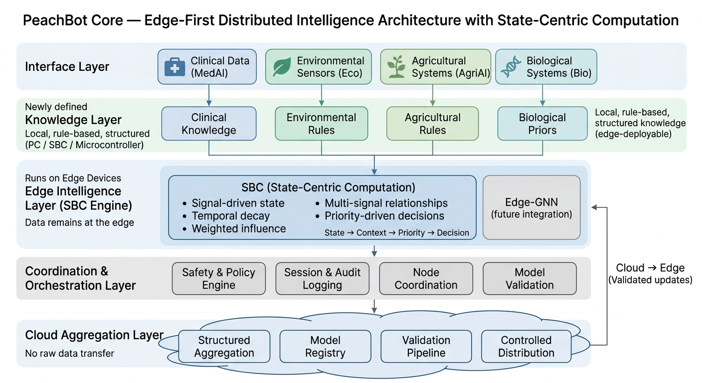

# PeachBot Core 
**Version:** v0.1.0 
### Distributed Edge Intelligence System with Biologically-Aware Computation

---

## Overview

PeachBot Core is the foundational system layer of the PeachBot platform, designed as a **distributed, edge-first intelligence architecture**.

The system enables:
- Real-time intelligence at the point of data generation  
- Structured local intelligence generation with system-level consistency 
- Deployment in constrained and latency-sensitive environments  

---
<p align="center">
  
</p>

## System Positioning

PeachBot Core represents a shift from:

**Centralized AI Systems**  
→ cloud-dependent, data aggregation heavy  

to  

**Distributed Edge Intelligence Systems**  
→ localized learning, federated coordination, governed aggregation  

---

## Core Architecture

PeachBot Core follows an edge-first, state-centric architecture composed of four interacting layers:

### 1. Interface Layer
- Real-world signal acquisition (clinical, environmental, agricultural)
- Converts raw inputs into structured system signals

### 2. Edge Intelligence Layer (SBC Engine)
- Synthetic Biological Computation (SBC) engine
- State-centric computation model
- Signal-driven state updates with:
  - temporal decay
  - weighted influence
  - multi-signal relationships
- Priority-driven decision influence

### 3. Coordination Layer
- Policy enforcement and safety evaluation
- Session management and audit logging
- Distributed orchestration across nodes (FILA-ready)

### 4. Cloud Aggregation Layer (FILA)
- Aggregation of structured edge outputs
- Model validation and registry
- Controlled redistribution of updates

> All primary computation, state evolution, and decision-making occur at the edge.
> The cloud performs coordination, not centralized training.

---

## Core Frameworks

### FILA — Federated Intelligence & Learning Architecture
- Local intelligence generation and state evolution at edge nodes  
- Structured session-level exports to aggregation layer  
- Aggregation without raw data transfer  
- Registry-driven validation and coordination 

---

### SBC — Synthetic Biological Computation

SBC defines the core computational model of PeachBot Core.

Unlike traditional AI systems that rely on stateless inference, SBC operates as a state-centric engine where system behavior emerges through evolving structured state.

Key properties:

- State-centric computation  
  → system intelligence is represented as evolving structured state

- Temporal dynamics  
  → signals decay over time, preserving recency relevance

- Weighted signal influence  
  → higher-intensity signals exert stronger impact on system behavior

- Multi-signal interaction  
  → relationships between signals are tracked, forming a graph-like structure

- Priority-driven decision model  
  → decisions are influenced by aggregate system state rather than isolated rules

This model enables adaptive, context-aware behavior aligned with real-world biological and environmental systems.

---

### Edge SoC Integration
- Hardware–software co-design  
- Hardware-aware execution design  
- Compatibility with embedded AI accelerators 
- Optimized real-time inference pathways    

---

## Key Characteristics

- Edge-first execution  
- Distributed intelligence coordination  
- Real-time adaptive decision-making  
- Minimal data centralization  
- Deployment-oriented system design  

---

## Repository Structure
```bash
docs/ → System architecture, research, compliance, IP
core/ → FILA, SBC, orchestration frameworks
interfaces/ → Domain-specific integrations
models/ → Edge AI and signal processing models
deployment/ → Infrastructure and configuration
```


---
## Graph Integration (Edge-GNN Alignment)

The SBC framework produces a structured representation of system state and signal relationships that is inherently graph-compatible.

- Signals → nodes  
- Relationships → edges  
- Weights → node/edge attributes  

This enables seamless integration with graph-based learning systems such as Edge-GNN.

The Edge-GNN framework introduces constraint-aware graph learning optimized for resource-constrained environments, balancing predictive performance with computational efficiency.

This alignment allows PeachBot Core to:

- Transition from rule-based evaluation to graph-based learning  
- Operate within CPU-only and edge-class hardware constraints  
- Maintain deployability across heterogeneous environments  

Edge-GNN provides the learning layer, while SBC provides the structured state representation.

Together, they form a unified edge-native intelligence system.

---

## System Status

PeachBot Core is currently in:

**Validated System Development → Deployment Transition**

- Core architecture implemented and documented  
- Edge intelligence modules under active development  
- Initial deployment scenarios simulated and validated in controlled environments (environmental systems)  
- Ongoing integration across clinical, environmental, and agricultural domains  

---

## Documentation

- [System Architecture](docs/architecture.md)  
- [Research Foundations](docs/research.md)  
- [Compliance & Standards](docs/compliance.md)  
- [Intellectual Property](docs/ip.md)  

---

## Context Within PeachBot Platform

PeachBot Core supports:

- Clinical intelligence systems (MedAI+)  
- Environmental monitoring networks (Eco)  
- Agricultural intelligence systems (AgriAI)  

---
## Execution Model

PeachBot Core operates using an edge-first, state-driven execution model:

1. Inputs are captured as structured signals  
2. Signals update the SBC state engine  
3. State evolves through temporal decay and interaction  
4. System priority is computed from aggregate state  
5. Decisions are generated through safety and policy layers  
6. Structured outputs are optionally exported via FILA  

This model ensures:

- Low-latency operation  
- Context-aware decision-making  
- Minimal data centralization  
- Compatibility with edge-constrained environments  

---

## Engineering Approach

- Edge-first system design  
- Federated learning (FILA)  
- Biologically-inspired computation (SBC)  
- Hardware–software co-design  
- Deployment-oriented architecture
- State-centric computation (SBC) with temporal, weighted, and relational dynamics    

---
## Design Philosophy

PeachBot Core is built on the following principles:

- **Edge-first intelligence**  
  → computation occurs at the point of data generation  

- **Distributed learning systems**  
  → intelligence emerges across nodes, not from a central model  

- **Minimal data centralization**  
  → raw data remains local wherever possible  

- **System-level integration**  
  → hardware, models, and orchestration are co-designed  

- **Deployment-oriented engineering**  
  → systems are designed for real-world constraints, not ideal environments

- **State-centric computation (SBC)**  
  → intelligence evolves through structured state transitions rather than isolated predictions 

---

## Deployment Context

PeachBot Core is designed to support:

- Clinical intelligence systems (MedAI+)  
- Environmental monitoring networks (Eco)  
- Agricultural intelligence platforms (AgriAI)  

These systems operate in:

- Low-connectivity environments  
- Resource-constrained hardware settings  
- Real-time decision-making scenarios
- Heterogeneous edge environments (microcontrollers, SBCs, and PC-based systems)  

---
## System Architecture Summary

PeachBot Core combines:

- Edge-first execution (where computation happens)  
- Synthetic Biological Computation (how intelligence emerges)  
- Federated Intelligence & Learning Architecture (how systems coordinate)  

This results in a distributed, adaptive intelligence system capable of operating across heterogeneous edge environments.

---

## Contributing

Contributions are welcome in areas including:

- Edge AI systems  
- Distributed learning architectures  
- Biological intelligence modeling  
- Deployment infrastructure  

Please refer to [CONTRIBUTING.md](CONTRIBUTING.md) for details.

## Note

This repository reflects an **active system under development**.  
Documentation and modules will evolve with ongoing deployment and validation efforts.